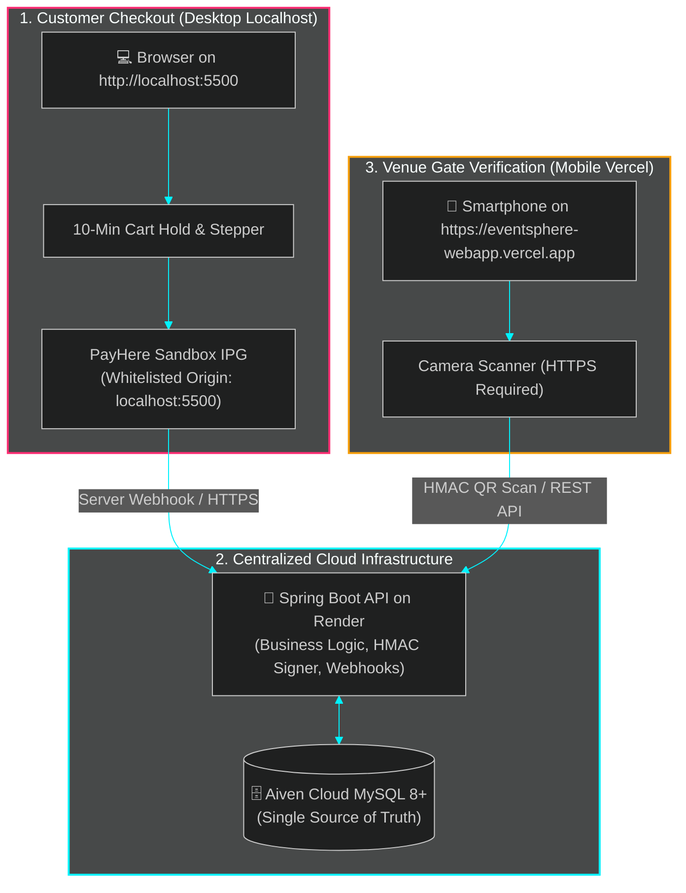

# 🎟️ EventSphere — Modern Event Discovery & Intelligent Ticketing Platform

<div align="center">

[](https://spring.io/projects/spring-boot)
[](https://openjdk.org/projects/jdk/21/)
[](https://eventsphere-webapp.vercel.app)
[](https://its-1114-eventsphere-booking-platform.onrender.com)
[](https://aiven.io/)
[](https://www.payhere.lk/)
[](https://ai.google.dev/)
[](https://docs.google.com/document/d/1X6XspO6Vx_Vn0Wct_69B55BjL2htt4JV/edit?usp=sharing&ouid=105743732836393895401&rtpof=true&sd=true)

<p align="center">
  <b>Enterprise-Grade, Cloud-Ready Event Management & Cryptographic Ticketing Engine</b><br/>
  Built for <b>ITS 1114 – Advanced API Development</b> at <b>IJSE (Institute of Software Engineering)</b><br/>
  📄 <b><a href="https://docs.google.com/document/d/1X6XspO6Vx_Vn0Wct_69B55BjL2htt4JV/edit?usp=sharing&ouid=105743732836393895401&rtpof=true&sd=true">Read the Full Project Report (Google Docs)</a></b>
</p>

</div>

---

## 🌌 Platform Overview & Cyber-Luxe Design System

**EventSphere** revolutionizes event discovery, real-time ticket reservations, and physical venue gate admission. It eliminates manual bank-slip uploads, WhatsApp coordination, and paper manifests with an automated three-tier architecture:

* 🎨 **Cyber-Luxe Visual Aesthetic**: Deep obsidian backgrounds (`#0E121C`), midnight glass cards (`rgba(18, 22, 34, 0.75)` with backdrop blur), neon rose gradients (`#FF2E74` $\rightarrow$ `#8B5CF6`), and modern typography (Cormorant Garamond & Inter).
* 🔒 **Anti-Overselling Concurrency Control**: Database-level pessimistic write locking (`LockModeType.PESSIMISTIC_WRITE` / `SELECT ... FOR UPDATE`) guarantees zero overselling during high-demand ticket drops.
* ⏱️ **10-Minute Cart Hold & Auto-Release**: Automated background scheduler restores unpurchased tickets automatically.
* 🛡️ **Cryptographic Anti-Tamper QR Passes**: HMAC-SHA256 signed passes pre-validated in memory before database queries, preventing ticket counterfeiting.
* 🎫 **Gate Check-In & Wristband Intelligence**: Instant venue gate verification on mobile devices with color-coded wristband directives and dual-tone Web Audio chimes.

---

## 🔀 The Hybrid Architecture: Why Vercel + Localhost?

EventSphere utilizes a **dual-environment hybrid workflow** designed to satisfy both payment sandbox domain policies and mobile device security constraints:



### 1. Why Customer Booking & Payments Run on `localhost:5500`
* **PayHere Sandbox Whitelisting**: PayHere's sandbox merchant profile validates the HTTP `Referer` and `Origin` headers against registered domains. The test merchant secret is registered for `localhost:5500`.
* **Zero Domain Errors**: Running the customer checkout on `http://localhost:5500` ensures that checkout hashes and return redirects work flawlessly without `401 Unauthorized / Domain Mismatch` sandbox rejections.

### 2. Why Gate Check-In Runs on Vercel (`https://eventsphere-webapp.vercel.app`)
* **Strict Mobile Camera Security (`getUserMedia`)**: Modern smartphone browsers (Chrome on Android, Safari on iOS) strictly forbid camera and hardware sensor access over insecure HTTP. **HTTPS is an absolute browser security requirement**. Vercel provides automatic SSL/TLS certificates and global CDN edge routing.
* **Gate Mobility**: Event gate staff move around with physical smartphones on cellular data (4G/5G) or venue Wi-Fi. They cannot access a developer's desktop `localhost` without complex reverse tunnels.

### 3. How the Cloud Database Connects Them Seamlessly
* Both the customer checking out on `http://localhost:5500` and the gate staff scanning on `https://eventsphere-webapp.vercel.app` point to the **exact same cloud backend (Render)** and **centralized database (Aiven MySQL)**.
* When a ticket is purchased on your PC, it is written to the cloud database.
* When gate staff scans that ticket from their smartphone on Vercel, the ticket is verified and marked as `USED` in that same cloud database in real time!

---

## ⚡ Step-by-Step Demo Execution Guide

Follow this guide to demonstrate the complete lifecycle from purchase to gate check-in:

### Phase 1: Customer Booking & Payment (On PC / Laptop)

1. **Launch the Local Frontend**:
   Open the `eventsphere_frontend` folder in VS Code and start **Live Server** on port **`5500`**, or run:
   ```bash
   python -m http.server 5500
   ```
2. **Access the Web App**:
   Navigate to **`http://localhost:5500/pages/events.html`** in your browser.
3. **Select an Event & Reserve Tickets**:
   * Click on an event (e.g., *"Neon Symphony 2026"* or *"Cyber Beats Festival"*).
   * Select ticket tiers (VIP, General, etc.) and proceed to checkout.
   * Notice the live **10-minute hold countdown timer** locking the inventory.
4. **Complete PayHere Sandbox Checkout**:
   * Click **"Proceed to Pay"** to launch the PayHere hosted popup/redirect.
   * Use the PayHere Sandbox test credentials (e.g., Card: `4111 1111 1111 1111`, Expiry: Any future date, CVV: `123`).
   * Complete payment.
5. **View Your Digital Ticket Pass**:
   * You will be redirected to the confirmed order screen and `ticket.html`.
   * You also receive an itemized email receipt and digital pass via **Brevo Transactional SMTP** (configured with authenticated SPF/DKIM alignment so emails land directly in the recipient's **Primary Inbox**, preventing tickets and OTPs from dropping into the Spam folder).
   * **Keep this digital ticket QR code displayed on your PC screen** for Phase 2!

---

### Phase 2: Venue Gate Check-In (On Smartphone via Vercel)

1. **Open the Mobile Scanner**:
   On your smartphone, open:
   $$\mathbf{\text{https://eventsphere-webapp.vercel.app/pages/check-in.html}}$$
2. **Log in with Organizer Credentials**:
   * Log in with an organizer account (e.g., your organizer credentials).
   * Grant camera permissions when prompted by your phone browser.
3. **Scan the Ticket from Your PC Screen**:
   * Aim your phone camera at the QR code displayed on your PC screen (or printed ticket).
4. **Observe the Gate Intelligence Output**:
   * 🔔 **Web Audio Chime**: Dual-tone confirmation sound (D5 $\rightarrow$ A5).
   * 🟢 **Entry Granted Badge**: High-contrast green status pill with localized scan timestamp.
   * 🎫 **Access Level Directive**: Tells door staff the exact tier and venue access zone:
     * ⭐ **VIP / PLATINUM ACCESS** (VIP Lounge • Front Row • Gold Pass)
     * ⚡ **ALL ACCESS / BACKSTAGE** (Staff • Artists • Full Venue Access)
     * 🎟️ **PRIORITY ENTRY** (Early Bird Passholder)
     * 🎫 **GENERAL ADMISSION** (Standard Entry • Main Area)
   * 📋 **Guest Manifest**: Shows Attendee Name, Seat/Zone allocation, Booking Reference (`REF: #...`), and check-in timestamp.
   * 🖐️ **Manual Confirmation Flow**: The details remain locked on screen so staff has time to admit the attendee. Tap **"Done — Scan Next Attendee"** when ready for the next guest!
5. **Test Duplicate Scan Prevention (Security Verification)**:
   * Scan the exact same QR code a second time.
   * 🚨 **Red Warning Alert**: Low warning buzz sounds immediately.
   * 🛑 **Duplicate Ticket Detected**: Shows *"This ticket was already used for entry at [Time] (Attendee: [Name])"*.
   * Result is permanently locked on screen for security inspection.

---

## 🎨 Color-Coded Wristband Intelligence

| Ticket Tier Pattern | Wristband Color | Accent Color | Visual Icon | Access Directives |
| :--- | :--- | :--- | :---: | :--- |
| **VIP / Platinum / Gold** | **GOLD WRISTBAND** | `#FBBF24` (Amber Gold) | ⭐ | VIP Lounge, Front Row, Complimentary Welcome Drink |
| **Backstage / Artist / Crew** | **CYAN WRISTBAND** | `#38BDF8` (Neon Cyan) | ⚡ | All-Access Pass, Sound Booth, Green Room |
| **Early Bird / Student** | **GREEN WRISTBAND** | `#34D399` (Emerald) | 🎟️ | Priority Early Entry, Fast-Track Gate |
| **General Admission / Standard**| **ROSE WRISTBAND** | `#FB7185` (Cyber Rose) | 🎫 | Main Concourse, Standing Arena |

---

## 👥 Three-Tier User Ecosystem & Permissions (RBAC)

| Role | Target Users | Key Capabilities & Workflows |
| :--- | :--- | :--- |
| **`ROLE_USER`** | **Attendees** | <ul><li>Browse, filter, and search published events</li><li>Select ticket tiers with a 10-minute hold window</li><li>Checkout via PayHere Sandbox / Live</li><li>Receive itemized receipts and cryptographic QR passes</li><li>Chat with Gemini AI for real-time recommendations</li></ul> |
| **`ROLE_ORGANIZER`** | **Event Hosts** | <ul><li>Submit business verification applications (BRN, NIC/Passport)</li><li>Schedule and publish events with Cloudinary media banners</li><li>Configure dynamic pricing tiers (VIP, General, Early Bird)</li><li>Monitor live ticket sales, revenues, and attendee manifests</li><li>Scan and validate QR admission passes at venue gates</li></ul> |
| **`ROLE_ADMIN`** | **System Admins** | <ul><li>Review, approve, or reject organizer credentials</li><li>Manage user accounts, roles, and status (Active, Suspended)</li><li>Oversee platform categories, venues, and audit logs</li><li>Inspect platform gross revenue and analytics</li></ul> |

---

## 💻 Technology Stack Breakdown

| Layer / Domain | Technology | Purpose & Implementation Details |
| :--- | :--- | :--- |
| **Frontend Core** | **HTML5, CSS3, Vanilla JS (ES6+)** | Responsive Dark Luxe & Midnight Glass UI, glassmorphism, micro-animations. |
| **UI Components** | **Bootstrap 5.3.3 & Bootstrap Icons** | Responsive grid, interactive dropdowns, and modern iconography. |
| **Gate Scanner** | **`html5-qrcode` + Web Audio API** | Real-time camera feed QR scanning with synthesized dual-tone audio feedback. |
| **Backend Framework** | **Spring Boot 3.2.4 (Java 21 LTS)** | Core REST API, IoC, transaction boundaries, asynchronous tasks. |
| **Security & Auth** | **Spring Security 6 + JJWT 0.11.5** | Stateless JWT authentication, role guards, BCrypt password hashing. |
| **Persistence & ORM**| **Spring Data JPA & Hibernate** | 15 interconnected domain entities, custom JPQL queries, HikariCP. |
| **Database** | **MySQL 8+ (Aiven Cloud)** | Relational database with ACID transactional integrity and row-level locking. |
| **Concurrency** | **Pessimistic Locking (`PESSIMISTIC_WRITE`)** | Zero overselling during simultaneous checkouts (`SELECT ... FOR UPDATE`). |
| **Payment Gateway** | **PayHere IPG** | Sandbox/Live payments with SHA-256 checkout hashes and MD5 webhook checks. |
| **Media Storage** | **Cloudinary CDN** | Direct client-side unsigned banner uploads with edge optimization. |
| **Artificial Intelligence**| **Google Gemini API (`gemini-3.5-flash-lite`)** | Natural language event assistant with server-side tool / function calling. |
| **QR Engine** | **Google ZXing 3.5.3** | Dynamic PNG QR code generation with HMAC-SHA256 signature verification. |
| **Email Service** | **Spring Mail + Brevo SMTP** | Asynchronous delivery of receipts, attendee passes, and 6-digit OTP codes. |
| **Hosting & Cloud** | **Vercel (Web) & Render (Backend)** | Serverless frontend deployment and continuous cloud backend hosting. |

---

## 📂 Frontend Application Directory

```
eventsphere_frontend/
├── index.html                   # Home page (hero search, categories, trending events, AI widget)
├── css/
│   ├── style.css                # Dark Luxe design system (tokens, colors, typography, layout)
│   ├── components.css           # Glass cards, filter bars, pill badges, ticket steppers
│   ├── dashboard.css            # Charts, donuts, and scanner frame styling
│   └── responsive.css           # Smartphones, foldables, tablets, and desktop breakpoints
├── js/
│   ├── env.js                   # Runtime public config generated from .env
│   ├── api/
│   │   ├── config.js            # esFetch wrapper, JWT auto-expiry check, and 401 recovery
│   │   ├── auth.js              # Register, login, OTP verification, password reset
│   │   ├── events.js            # Public event search, organizer event management
│   │   ├── bookings.js          # Cart hold, booking creation, attendee ticket lookup
│   │   ├── payments.js          # PayHere hash checkout & status verification
│   │   └── organizer.js         # Organizer analytics, check-in API, attendee lists
│   └── utils/
│       ├── nav.js               # Dynamic navbar rendering (auth state, avatar, role links)
│       ├── ai-widget.js         # Google Gemini floating conversational assistant
│       ├── otp-modal.js         # 6-digit OTP modal dialog with countdown timer
│       ├── toast.js             # Cyber-luxe toast notifications (success, error, warning)
│       └── icons.js             # SVG icon definitions (sparkles, bells, status)
├── pages/
│   ├── events.html              # All events directory with comprehensive filter bar
│   ├── event-details.html       # Event details, Cloudinary hero, seat availability
│   ├── booking.html             # Quantity stepper, 10-min hold timer, PayHere checkout
│   ├── ticket.html              # Digital admission pass, dynamic QR code, print view
│   ├── my-bookings.html         # Attendee booking history and ticket retrieval
│   ├── login.html               # User login with role-based dashboard redirects
│   ├── register.html            # Registration form triggering OTP modal
│   ├── organizer-apply.html     # Organizer business application (BRN, NIC verification)
│   ├── organizer-dashboard.html # Organizer portal: event sales, revenues, and controls
│   ├── create-event.html        # Event creator with Cloudinary unsigned image upload
│   ├── check-in.html            # Gate scanner with wristband directive & audio chimes
│   ├── admin-dashboard.html     # Administrator panel (approvals, users, categories, venues)
│   └── about.html               # Platform architecture, technology specs, and trust policy
├── scripts/
│   └── generate_env.py          # Python script generating js/env.js from .env safely
├── dev.bat                      # Windows one-click local development startup script
├── dev.sh                       # Linux / macOS local development startup script
├── .env.example                 # Example frontend environment variables
└── vercel.json                  # Vercel project deployment configuration
```

---

## 🔒 Security & Privacy Practices

* **Zero Credential Exposure:** Frontend `.env` only contains browser-safe public settings. Backend secrets (JWT secret, DB password, Gemini API key, Brevo credentials) are strictly retained on Render.
* **Salted Password Encryption:** Passwords use BCrypt with a cost factor of 12.
* **Payment Isolation:** All card data entry occurs on PayHere's hosted PCI-DSS compliant interface. EventSphere never stores or handles credit card numbers.
* **Single-Use Cryptographic Tickets:** Admission QR passes transition immediately to `USED` upon gate scan with append-only audit trails to prevent reuse.

---

## 🌐 Live Deployments & Project Links

* **Frontend Web Application (Vercel):** [https://eventsphere-webapp.vercel.app](https://eventsphere-webapp.vercel.app)
* **Backend REST API (Render):** [https://its-1114-eventsphere-booking-platform.onrender.com](https://its-1114-eventsphere-booking-platform.onrender.com)
* **Cloud Database:** Hosted on Aiven MySQL with connection pooling.
* **Payment Gateway:** PayHere Merchant Portal (Sandbox / Live Mode).
* **Project Documentation / Report:** [EventSphere Project Report (Google Docs)](https://docs.google.com/document/d/1X6XspO6Vx_Vn0Wct_69B55BjL2htt4JV/edit?usp=sharing&ouid=105743732836393895401&rtpof=true&sd=true)

---

## 🎓 Academic Module Information

* **Course:** Semester 2 — AAD (Advanced API Development — ITS 1114) Module Coursework
* **Institution:** IJSE (Institute of Software Engineering)
* **Author:** Lasandi Salwathura
* **Project Documentation:** [EventSphere Project Report (Google Docs)](https://docs.google.com/document/d/1X6XspO6Vx_Vn0Wct_69B55BjL2htt4JV/edit?usp=sharing&ouid=105743732836393895401&rtpof=true&sd=true)

